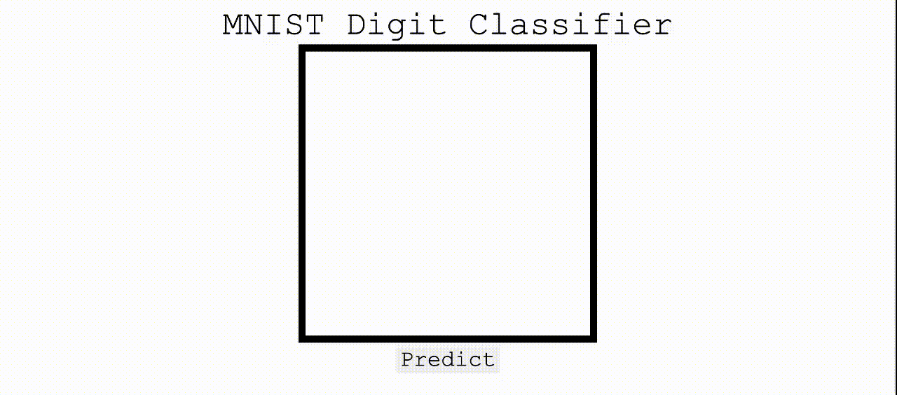

# Digit Draw

This program uses a pretrained MNIST Classification model to predict a user-drawn digit through Flask.




## Setup

```bash
conda install pytorch torchvision torchaudio cudatoolkit=10.2 -c pytorch
pip install -r requirements.txt

flask run
```
Then, go to http://127.0.0.1:5000.

## Usage
Draw a number and click "predict" to see the prediction!

